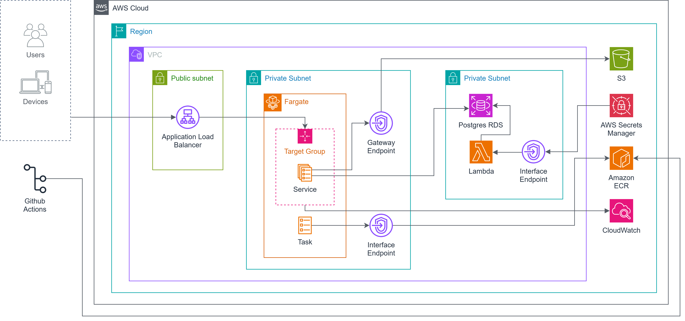

    
  
    

# Overview

A web application designed to help aquarium and reef tank owners log, visualize, and monitor key water parameters like calcium, alkalinity, magnesium, nitrate, and more. Stay on top of your water chemistry and track trends over time.

## Features

- 🧪 Track essential water parameters (Ca, Alk, Mg, NO₃, PO₄, etc.)
- 📈 Visualize trends with interactive charts
- 🗓️ Add notes and timestamps for each test
- 🔔 Set parameter thresholds and get alerts when out of range
- 🔍 Filter by date ranges or parameter type
- 📲 Mobile-friendly responsive design

<!--  -->

## Documentation

#### AWS Architecture Diagram

  

## Tech Stack

- **Frontend:** React / TailwindCSS
- **Backend:** Node.js / Express / PostgreSQL
